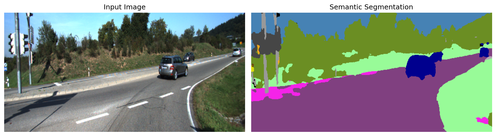
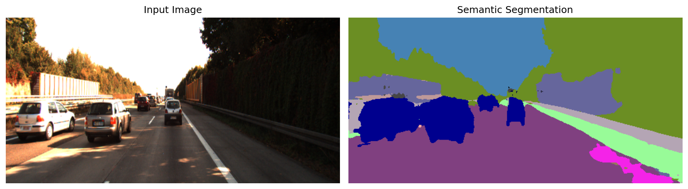
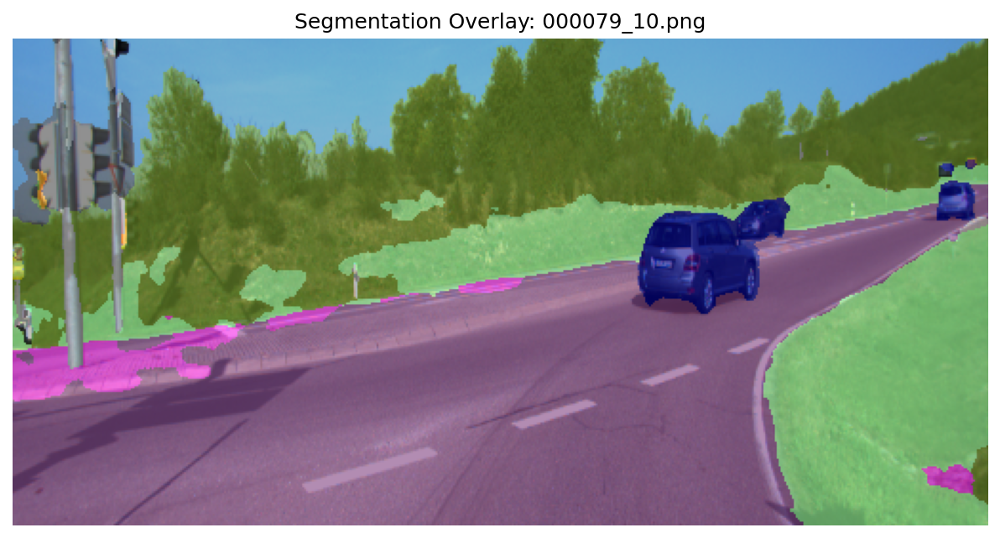
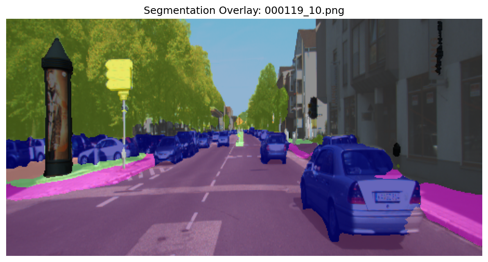
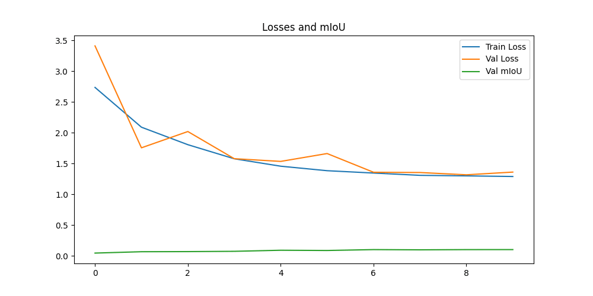

# KITTI Semantic Segmentation with UNet

A PyTorch implementation of semantic segmentation on the KITTI dataset using a UNet architecture. This project provides end-to-end training and inference capabilities for autonomous driving scene understanding.

## Features

 - UNet Architecture - Custom with skip connections
 - KITTI Dataset Utils
 - Data Augmentation
 - Efficient Training

## Results

 - Side by side segmented visualization
 - Overlay Visualization with transparency
 - Training Progress Video

### Segmentation Results

#### Side by side visualization



#### Overlay Results



#### Training Progress


## Installation

### Requirements

```bash
pip install torch torchvision
pip install albumentations
pip install matplotlib
pip install numpy
pip install Pillow
pip install tqdm
```

### Dataset Setup

  1. Download the KITTI semantic segmentation dataset
  2. Extract to the following structure:
     ```text
     data/
      ├── data_semantics/
      │   ├── training/
      │   │   ├── image_2/        # RGB images
      │   │   └── semantic/       # Ground truth masks
      │   └── testing/
      │       └── image_2/        # Test images
      └── devkit_semantics/       # KITTI devkit with label definitions
     ```

## Usage

### Training

```bash
python train.py
```

### Inference

```bash
python inference.py
```

## Acknowledgments

  - KITTI dataset creators for providing the benchmark
  - PyTorch team for the deep learning framework
  - Albumentations library for data augmentation tools
